# "Proyecto Cotización de envio de productos"
*Evaluación ténica de ingreso para Tendency Innovations.*

## Descrición:
Evaluación técnica para Tendency Innovations, proyecto para cotización y envio de productos.

Este es un proyecto API y Web que obtiene una lista de productos de una base de datos y con ellos se puede generar una solicitud de cotización de envio por paqueteria y su registro de envio utilizando la API de Envia.com.

Dentro del proyecto API tambien pueden realizarse peticiones REST API para la consulta, creación, actualización y eliminación de la tabla "products" utilizando Postman u otra herramiento de manejo de peticiones HTTP (un CRUD).

## Desarrollado por:
Ing. Alan Eduardo Aguilar Guerrero (Desarrollador Jr.)

## Fecha:
Viernes 19 de Abril del 2024

## Principales tecnologías:
### Proyecto /API
* node js v20.9.0
* express v4.18.2
* sequelize v6.36.0
* jsonwebtoken v9.0.2
* MySQL v8.0

### Proyecto /Web
* react js + Vite v18.2.55
* bootstrap v4.6.2
* axios v1.6.7
* sweetalert2 v11.10.8

## Instrucciones para generar base de datos en MySQL:
1. Dentro de los archivos de repositorio de GitHub encontrará la carpeta /db a la misma altura de ficheros que /api y /web, dentro de la carpeta encontrará el archivo "Dump20240419.sql" ese archivo es la base de datos de este proyecto, descargue el archivo en su maquina.

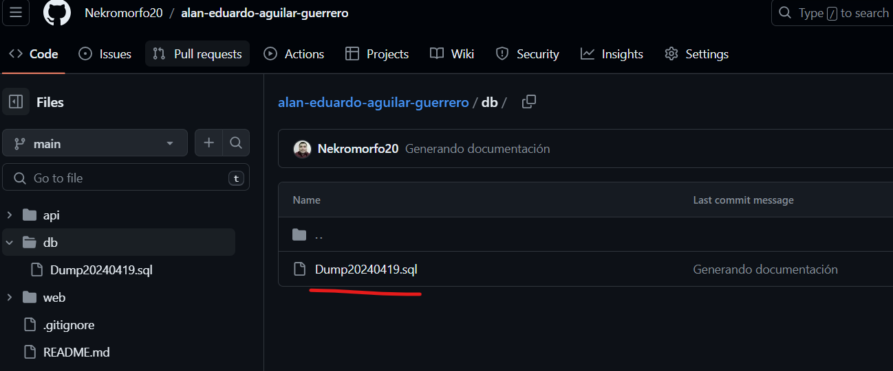

2. Descargue e instale MySQL de la página oficial "https://dev.mysql.com/downloads/mysql/" seleccionando la versión 8.3, ejecute el instalador .msi del programa y abra la aplicación "MySQL Workbench 8.0" una vez termine de realizar las instalaciones.

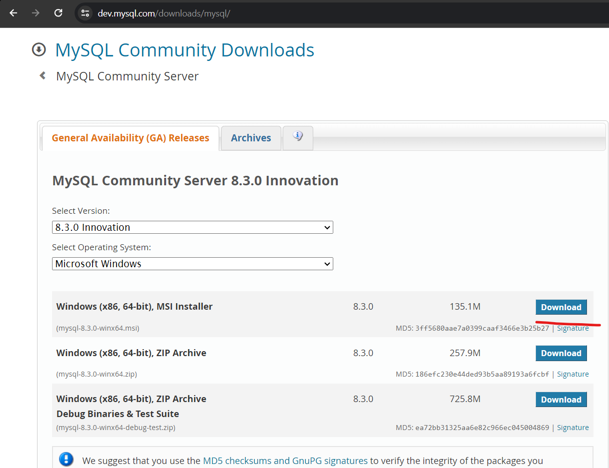

3. Inicie sesión con su usuario de MySQL en su conección local, una vez iniciada la sesión, seleccione la pestaña "Administración" y seleccione del grupo "MANAGEMENT" la opción "Data Import/Restore".

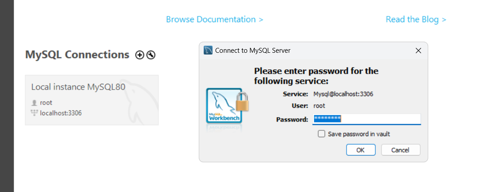

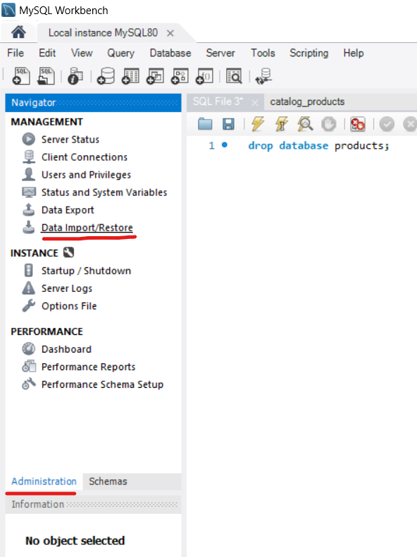

4. Seleccione la opción "Import from Self-Container File" y de clic en el boton "...", esto abrira su explorador de archivos y procedera ubicar y seleccionar el archivo "Dump20240419.sql" descargado en el paso 1.
Una vez seleccionado de clic en el botón "Start Import", con esto ya se habra generado la base de datos de forma local en su máquina.

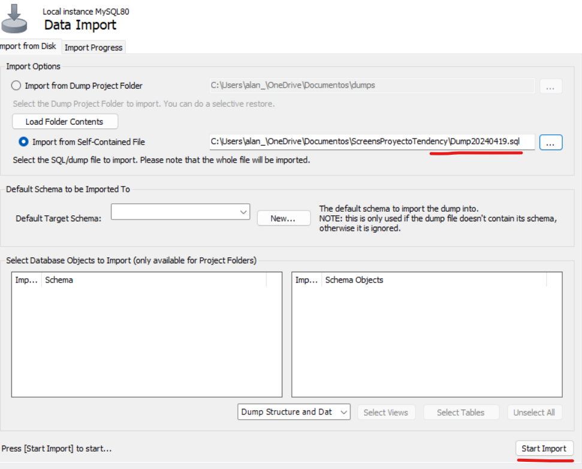

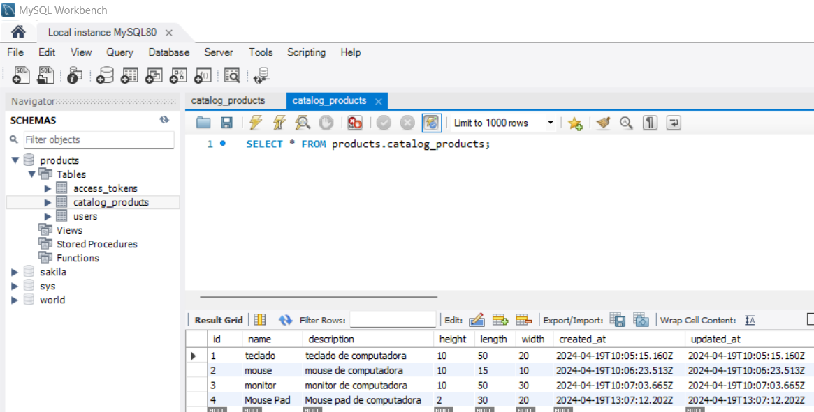

## Instrucciones para instalación de proyecto:
1. Descargue este proyecto instalando la herramienta de gestion de repositorios "Git"de la siguiente URL "https://git-scm.com/downloads" y utilizando el comando `git clone https://github.com/Nekromorfo20/proyecto-recibos-api.git` en una terminal (Simbolo del sistema) desde su computadora y mientras se encuentre en el directorio donde guste colocar el proyecto. Tambien puede descargar el proyecto como archivo ".zip" seleccionando el botón "<> Code" y seleccionando la opción "Download ZIP".

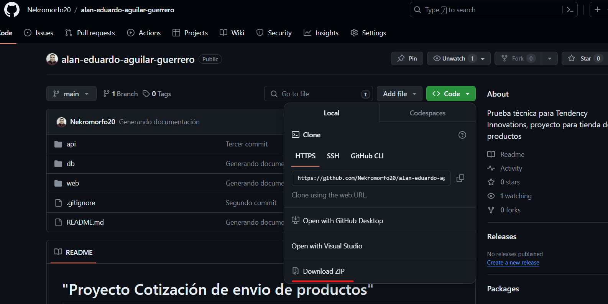

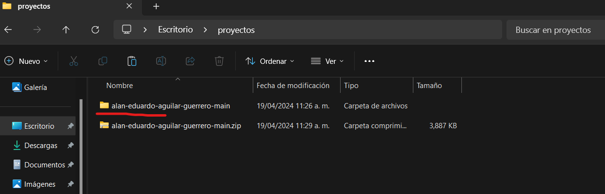

2. Para instalar el proyecto API abra una terminal en su computadora y coloque la dirección del directorio donde el proyecto fue descargado moviendose con el comando `cd <ruta_computador>`, coloquese a nivel raíz del proyecto /api (donde pueda visualizar el archivo "package.json") una vez ubicado ejecute el comando `npm install` para instalar todas las dependencias.

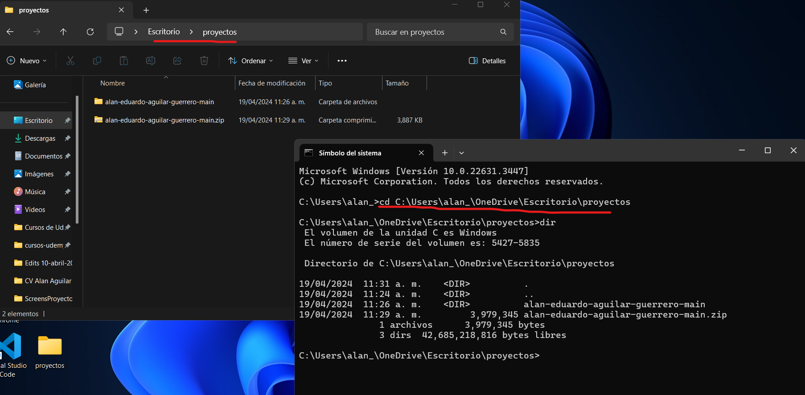

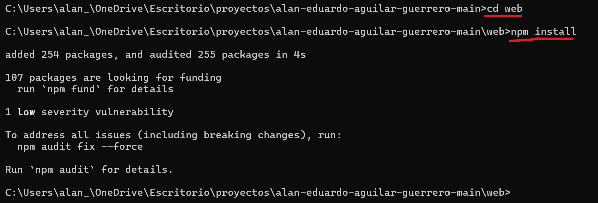

3. Una vez instaladas las dependencias ejecute el comando `npm run dev` para iniciar el proyecto.

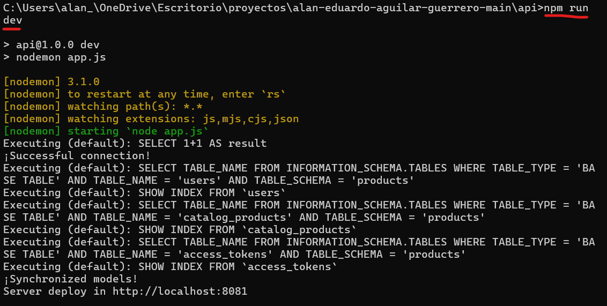

4. Para instalar el proyecto Web abra una nueva terminal en su computadora y coloque la dirección del directorio donde el proyecto fue descargado moviendose con el comando `cd <ruta_computador>`, coloquese a nivel raíz del proyecto /web (donde pueda visualizar el archivo "package.json") una vez ubicado ejecute el comando `npm install` para instalar todas las dependencias.

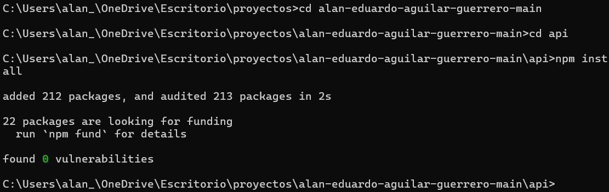

5. Una vez instaladas las dependencias ejecute el comando `npm run dev` para iniciar el proyecto.

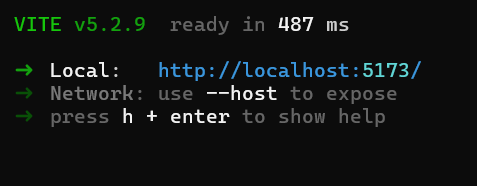

6. Puede verificar que todo funciona correctamente ingresando a la URL "http://localhost:5173/" donde estará desplegado el proyecto web funcionando en conjunto con el proyecto API.

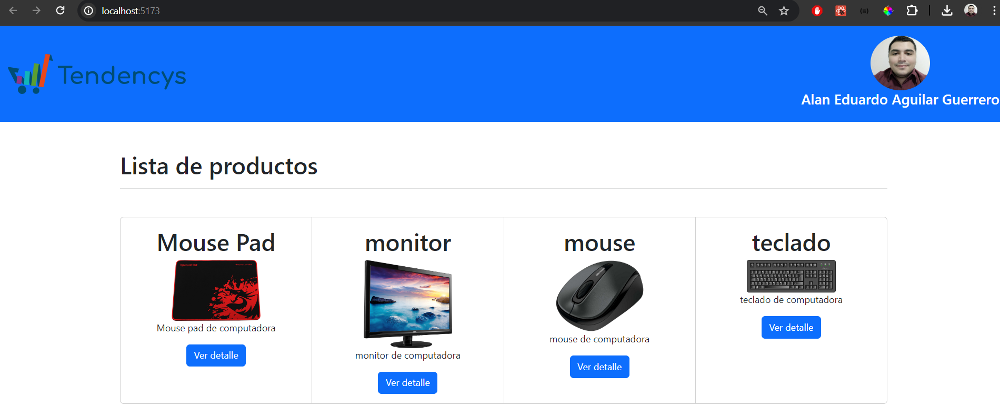

## Usuario de prueba:
Usuario: alan